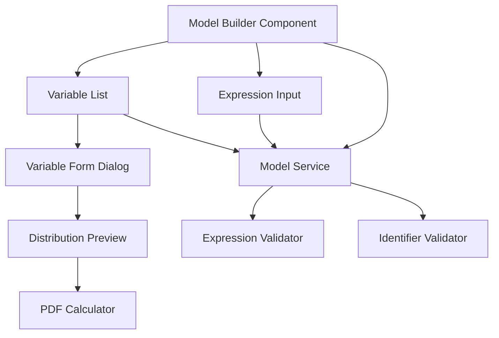
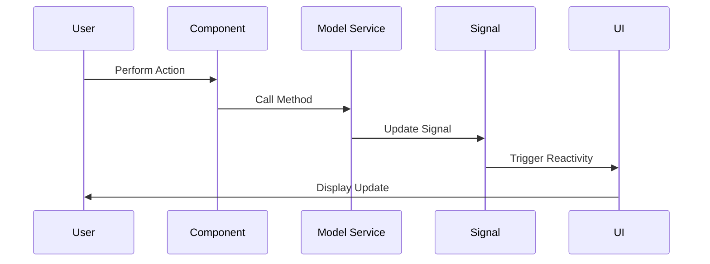

# Design Document: Monte Carlo Model Builder UI

## Overview

The Monte Carlo Model Builder UI is a standalone Angular component that provides an interface for defining simulation models. The design follows a reactive architecture using Angular signals for state management, ensuring the UI automatically updates when model data changes.

The component is organized into two main sections:
1. **Variables Section**: Manages variables with probability distributions
2. **Expression Section**: Allows users to write mathematical expressions using defined variables and literal numeric values

The design emphasizes immediate validation feedback, clear visual organization, and adherence to the project's UI/UX guidelines using PrimeNG components and TailwindCSS.

## Architecture

### Component Structure

**Component Hierarchy**



**File Structure**
```
model-builder/
├── model-builder.component.ts          # Main container component
├── model-builder.component.html        # Main template
├── model-builder.component.css         # Component styles
├── variable-list/
│   ├── variable-list.component.ts      # Variables section
│   ├── variable-list.component.html
│   └── variable-list.component.css
├── variable-form/
│   ├── variable-form.component.ts      # Add/Edit variable dialog
│   ├── variable-form.component.html
│   └── variable-form.component.css
├── distribution-preview/
│   ├── distribution-preview.component.ts   # Distribution PDF visualization
│   ├── distribution-preview.component.html
│   └── distribution-preview.component.css
├── expression-input/
│   ├── expression-input.component.ts   # Expression section with validation
│   ├── expression-input.component.html
│   └── expression-input.component.css
└── services/
    ├── model.service.ts                # State management service
    ├── expression-validator.service.ts # Expression validation logic
    ├── identifier-validator.service.ts # Identifier validation logic
    └── pdf-calculator.service.ts       # Probability density function calculations
```

### State Management Architecture

The application uses Angular signals for reactive state management:

```typescript
// model.service.ts
export class ModelService {
  // Core state signals
  private variablesSignal = signal<Variable[]>([]);
  private expressionSignal = signal<string>('');
  
  // Computed signals for derived state
  readonly variables = this.variablesSignal.asReadonly();
  readonly expression = this.expressionSignal.asReadonly();
  
  readonly allIdentifiers = computed(() => 
    this.variables().map(v => v.name)
  );
}
```

### Data Flow

**State Update Flow**



1. **User Action** → Component emits event
2. **Component** → Calls service method
3. **Service** → Updates signal
4. **Signal Change** → Triggers computed signals and UI updates
5. **Validation** → Runs automatically via computed signals
6. **UI** → Displays updated state and validation results

## Components and Interfaces

### ModelBuilderComponent

**Purpose**: Main container component that orchestrates the two sections.

**Responsibilities**:
- Layout the two sections (variables, expression)
- Inject and provide ModelService to child components
- Handle overall component lifecycle

**Template Structure**:
```html
<div class="model-builder-container p-4">
  <p-card header="Monte Carlo Model Builder">
    <app-variable-list />
    <app-expression-input />
  </p-card>
</div>
```

**Inputs**: None (top-level component)

**Outputs**: None (state managed internally)

---

### VariableListComponent

**Purpose**: Display and manage the list of variables.

**Responsibilities**:
- Display all defined variables in a list
- Provide "Add Variable" button
- Provide "Edit" and "Delete" actions for each variable
- Open VariableFormComponent dialog for add/edit operations

**Template Structure**:
```html
<div class="variable-section mb-4">
  <div class="flex items-center justify-between mb-2">
    <h3>Variables</h3>
    <p-button label="Add Variable" icon="pi pi-plus" (onClick)="openAddDialog()" />
  </div>
  
  <div *ngIf="variables().length === 0" class="empty-state">
    <p>No variables defined. Click "Add Variable" to create one.</p>
  </div>
  
  <div *ngFor="let variable of variables()" class="variable-item">
    <div class="variable-info">
      <span class="variable-name">{{ variable.name }}</span>
      <span class="variable-distribution">{{ variable.distribution }}</span>
      <span class="variable-params">{{ formatParams(variable) }}</span>
    </div>
    <div class="variable-actions">
      <p-button icon="pi pi-pencil" (onClick)="openEditDialog(variable)" />
      <p-button icon="pi pi-trash" (onClick)="deleteVariable(variable)" />
    </div>
  </div>
</div>
```

**Inputs**: None (reads from ModelService)

**Outputs**: None (updates via ModelService)

**Key Methods**:
- `openAddDialog()`: Opens dialog for creating new variable
- `openEditDialog(variable: Variable)`: Opens dialog for editing existing variable
- `deleteVariable(variable: Variable)`: Removes variable from model
- `formatParams(variable: Variable)`: Formats distribution parameters for display

---

### VariableFormComponent

**Purpose**: Dialog form for adding or editing a variable.

**Responsibilities**:
- Display form fields for variable properties
- Validate input data
- Show/hide distribution parameter fields based on selected distribution type
- Display real-time distribution preview chart
- Submit valid data to ModelService

**Template Structure**:
```html
<p-dialog [(visible)]="visible" [header]="isEditMode ? 'Edit Variable' : 'Add Variable'" [style]="{width: '800px'}">
  <div class="flex gap-6">
    <!-- Left side: Form fields -->
    <div class="flex-1">
      <form (submit)="onSubmit($event)">
        <div class="form-field">
          <label for="name">Name</label>
          <input pInputText id="name" [(ngModel)]="formData.name" required />
          <small *ngIf="nameError" class="error">{{ nameError }}</small>
        </div>
        
        <div class="form-field">
          <label for="distribution">Distribution</label>
          <p-dropdown 
            id="distribution" 
            [options]="distributionOptions" 
            [(ngModel)]="formData.distribution"
            (onChange)="onDistributionChange()"
          />
        </div>
        
        <!-- Normal/Lognormal parameters -->
        <div *ngIf="formData.distribution === 'Normal' || formData.distribution === 'Lognormal'">
          <div class="form-field">
            <label for="mean">Mean</label>
            <input pInputText id="mean" type="number" [(ngModel)]="formData.mean" required />
            <small *ngIf="meanError" class="error">{{ meanError }}</small>
          </div>
          <div class="form-field">
            <label for="stdDev">Standard Deviation</label>
            <input pInputText id="stdDev" type="number" [(ngModel)]="formData.stdDev" required />
            <small *ngIf="stdDevError" class="error">{{ stdDevError }}</small>
          </div>
        </div>
        
        <!-- Uniform parameters -->
        <div *ngIf="formData.distribution === 'Uniform'">
          <div class="form-field">
            <label for="min">Minimum</label>
            <input pInputText id="min" type="number" [(ngModel)]="formData.min" required />
            <small *ngIf="minError" class="error">{{ minError }}</small>
          </div>
          <div class="form-field">
            <label for="max">Maximum</label>
            <input pInputText id="max" type="number" [(ngModel)]="formData.max" required />
            <small *ngIf="maxError" class="error">{{ maxError }}</small>
          </div>
        </div>
        
        <div class="form-actions">
          <p-button type="submit" label="Save" [disabled]="!isFormValid()" />
          <p-button type="button" label="Cancel" (onClick)="onCancel()" />
        </div>
      </form>
    </div>
    
    <!-- Right side: Distribution preview -->
    <div class="flex-1">
      <app-distribution-preview 
        [distribution]="formData.distribution"
        [mean]="formData.mean"
        [stdDev]="formData.stdDev"
        [min]="formData.min"
        [max]="formData.max"
      />
    </div>
  </div>
</p-dialog>
```

**Inputs**:
- `visible: boolean`: Controls dialog visibility
- `variable?: Variable`: Variable to edit (undefined for add mode)

**Outputs**:
- `visibleChange: EventEmitter<boolean>`: Emits when dialog closes
- `save: EventEmitter<Variable>`: Emits when form is submitted with valid data

**Key Methods**:
- `onSubmit(event: Event)`: Validates and submits form data
- `onDistributionChange()`: Resets parameter fields when distribution changes
- `isFormValid()`: Returns true if all validation passes
- `validateName()`: Validates identifier format and uniqueness
- `validateParameters()`: Validates distribution parameters

---

### ExpressionInputComponent

**Purpose**: Provide text input for mathematical expressions with real-time validation.

**Responsibilities**:
- Display text input for expression
- Validate expression in real-time as user types
- Display validation status (valid/invalid)
- Display specific error messages for invalid expressions

**Template Structure**:
```html
<div class="expression-section mb-4">
  <h3>Model Expression</h3>
  
  <div class="form-field">
    <label for="expression">Expression</label>
    <input 
      pInputText 
      id="expression" 
      [(ngModel)]="expressionText"
      (ngModelChange)="onExpressionChange($event)"
      placeholder="e.g., (var1 + var2) * const1"
      [class.invalid]="!validationResult().isValid"
    />
    
    <div *ngIf="validationResult().isValid" class="validation-success">
      <i class="pi pi-check-circle"></i>
      <span>Expression is valid</span>
    </div>
    
    <div *ngIf="!validationResult().isValid && validationResult().errors.length > 0" class="validation-errors">
      <i class="pi pi-times-circle"></i>
      <ul>
        <li *ngFor="let error of validationResult().errors">{{ error }}</li>
      </ul>
    </div>
  </div>
  
  <div class="available-identifiers">
    <h4>Available Identifiers</h4>
    <div class="identifier-list">
      <span *ngFor="let id of availableIdentifiers()" class="identifier-badge">
        {{ id }}
      </span>
    </div>
  </div>
</div>
```

**Inputs**: None (reads from ModelService)

**Outputs**: None (updates via ModelService)

**Key Methods**:
- `onExpressionChange(value: string)`: Updates expression in ModelService and triggers validation
- `validationResult()`: Computed signal returning validation status and errors
- `availableIdentifiers()`: Computed signal returning list of all defined identifiers

---

### DistributionPreviewComponent

**Purpose**: Display a real-time visualization of the probability density function for a distribution.

**Responsibilities**:
- Calculate PDF values for the selected distribution type
- Render a line chart showing the probability density function
- Update the chart in real-time as parameters change
- Display appropriate x-axis range based on distribution parameters

**Template Structure**:
```html
<div class="distribution-preview">
  <h4>Distribution Preview</h4>
  <p-chart 
    type="line" 
    [data]="chartData()" 
    [options]="chartOptions"
    [style]="{height: '300px'}"
  />
</div>
```

**Inputs**:
- `distribution: DistributionType`: The selected distribution type
- `mean?: number`: Mean parameter (for Normal/Lognormal)
- `stdDev?: number`: Standard deviation parameter (for Normal/Lognormal)
- `min?: number`: Minimum parameter (for Uniform)
- `max?: number`: Maximum parameter (for Uniform)

**Outputs**: None

**Key Methods**:
- `chartData()`: Computed signal that generates chart data based on current parameters
- `generatePDFData()`: Generates x and y coordinates for the PDF curve
- `calculateXRange()`: Determines appropriate x-axis range based on distribution and parameters

**Chart Configuration**:
- Use PrimeNG Chart component (based on Chart.js)
- Line chart with smooth curves
- X-axis: Value range
- Y-axis: Probability density
- Display min/max values on x-axis for Uniform distribution
- Display mean ± 3*stdDev range for Normal/Lognormal distributions

---

### PDFCalculatorService

**Purpose**: Calculate probability density function values for different distribution types.

**Responsibilities**:
- Calculate PDF values for Normal distribution
- Calculate PDF values for Lognormal distribution
- Calculate PDF values for Uniform distribution
- Provide utility functions for statistical calculations

**Interface**:
```typescript
export interface PDFPoint {
  x: number;
  y: number;
}

export class PDFCalculatorService {
  calculateNormalPDF(x: number, mean: number, stdDev: number): number;
  calculateLognormalPDF(x: number, mean: number, stdDev: number): number;
  calculateUniformPDF(x: number, min: number, max: number): number;
  
  generatePDFPoints(
    distribution: DistributionType,
    params: { mean?: number; stdDev?: number; min?: number; max?: number },
    numPoints?: number
  ): PDFPoint[];
}
```

**PDF Calculation Formulas**:

1. **Normal Distribution**:
   ```
   PDF(x) = (1 / (σ * √(2π))) * e^(-((x - μ)²) / (2σ²))
   where μ = mean, σ = stdDev
   ```

2. **Lognormal Distribution**:
   ```
   PDF(x) = (1 / (x * σ * √(2π))) * e^(-((ln(x) - μ)²) / (2σ²))
   where μ = mean, σ = stdDev, x > 0
   ```

3. **Uniform Distribution**:
   ```
   PDF(x) = 1 / (max - min)  if min ≤ x ≤ max
   PDF(x) = 0                otherwise
   ```

**X-Range Calculation**:
- Normal: [mean - 4*stdDev, mean + 4*stdDev]
- Lognormal: [0.01, mean + 4*stdDev] (avoid x=0)
- Uniform: [min - 0.1*(max-min), max + 0.1*(max-min)] (add padding)

**Number of Points**: Default 200 points for smooth curves

---

### ModelService

**Purpose**: Centralized state management for the model builder.

**Responsibilities**:
- Store and manage variables and expression
- Provide signals for reactive UI updates
- Provide methods for CRUD operations on variables
- Coordinate with validation services

**Interface**:
```typescript
export class ModelService {
  // Read-only signals for components
  readonly variables: Signal<Variable[]>;
  readonly expression: Signal<string>;
  readonly allIdentifiers: Signal<string[]>;
  
  // Variable operations
  addVariable(variable: Variable): void;
  updateVariable(oldName: string, variable: Variable): void;
  deleteVariable(name: string): void;
  getVariable(name: string): Variable | undefined;
  
  // Expression operations
  setExpression(expression: string): void;
  
  // Validation helpers
  isIdentifierUnique(name: string, excludeName?: string): boolean;
}
```

---

### ExpressionValidatorService

**Purpose**: Validate mathematical expressions.

**Responsibilities**:
- Parse expression syntax
- Check for undefined identifiers
- Detect syntax errors
- Return detailed validation results

**Interface**:
```typescript
export interface ValidationResult {
  isValid: boolean;
  errors: string[];
}

export class ExpressionValidatorService {
  validate(expression: string, validIdentifiers: string[]): ValidationResult;
  
  private checkSyntax(expression: string): string[];
  private checkIdentifiers(expression: string, validIdentifiers: string[]): string[];
  private extractIdentifiers(expression: string): string[];
}
```

**Validation Logic**:
1. **Syntax Validation**: Check for balanced parentheses, valid operators, proper operator placement
2. **Identifier Validation**: Extract all identifiers from expression and verify each exists in validIdentifiers
3. **Error Reporting**: Return specific, actionable error messages

**Expression Parsing Strategy**:
- Use regular expressions to extract identifiers (sequences of alphanumeric characters)
- Validate operator placement (no consecutive operators, operators not at start/end)
- Check parentheses balance using stack-based algorithm
- Support operators: `+`, `-`, `*`, `/`, `(`, `)`

---

### IdentifierValidatorService

**Purpose**: Validate identifier names for variables.

**Responsibilities**:
- Check identifier format (alphanumeric only)
- Provide clear error messages for invalid identifiers

**Interface**:
```typescript
export interface IdentifierValidationResult {
  isValid: boolean;
  error?: string;
}

export class IdentifierValidatorService {
  validate(name: string): IdentifierValidationResult;
}
```

**Validation Rules**:
- Must contain only alphanumeric characters (a-z, A-Z, 0-9)
- Must not be empty
- Must not start with a number (optional, but good practice)
- Case-sensitive

## Data Models

### Variable

Represents a model variable with a probability distribution.

```typescript
export type DistributionType = 'Normal' | 'Lognormal' | 'Uniform';

export interface NormalDistribution {
  type: 'Normal';
  mean: number;
  stdDev: number;
}

export interface LognormalDistribution {
  type: 'Lognormal';
  mean: number;
  stdDev: number;
}

export interface UniformDistribution {
  type: 'Uniform';
  min: number;
  max: number;
}

export type Distribution = NormalDistribution | LognormalDistribution | UniformDistribution;

export interface Variable {
  name: string;
  distribution: Distribution;
}
```

**Validation Rules**:
- `name`: Must be valid identifier (alphanumeric only)
- `distribution.mean`: Must be a valid number
- `distribution.stdDev`: Must be a positive number (> 0)
- `distribution.min`: Must be a valid number
- `distribution.max`: Must be a valid number and greater than `min`

---

### Model State

The complete model state managed by ModelService.

```typescript
export interface ModelState {
  variables: Variable[];
  expression: string;
}
```

This represents the complete user-defined model that could be serialized for saving or passed to the simulation engine in future phases.

## Correctness Properties


A property is a characteristic or behavior that should hold true across all valid executions of a system—essentially, a formal statement about what the system should do. Properties serve as the bridge between human-readable specifications and machine-verifiable correctness guarantees.

### Property 1: Required Fields Enforcement

*For any* variable creation attempt, if any required field (name, distribution type, or distribution parameters) is missing or empty, the form submission should be prevented and the variable should not be added to the model.

**Validates: Requirements 1.1**

### Property 2: Distribution-Specific Parameter Validation

*For any* variable with a selected distribution type, the form should require and validate only the parameters appropriate for that distribution type (Normal/Lognormal require mean and stdDev; Uniform requires min and max).

**Validates: Requirements 1.2, 1.3, 1.4**

### Property 3: Identifier Format Validation

*For any* identifier name (variable), the system should accept it only if it contains exclusively alphanumeric characters, and should reject any name containing spaces, special characters, or being empty.

**Validates: Requirements 1.5, 4.3**

### Property 4: Identifier Uniqueness

*For any* new variable name, the system should prevent creation if an identifier with that name already exists, and should display an error message indicating the duplicate.

**Validates: Requirements 1.6**

### Property 5: Cascading Validation on Edit

*For any* variable that is edited, if that identifier is referenced in the expression, the expression should be automatically re-validated after the edit is saved.

**Validates: Requirements 1.7**

### Property 6: Cascading Invalidation on Deletion

*For any* variable that is deleted, if that identifier is referenced in the expression, the expression should be marked as invalid and should display an error indicating which identifier is undefined.

**Validates: Requirements 1.8, 2.8**

### Property 7: Complete List Display

*For any* set of defined variables, all items should appear in the list section with complete information (name, distribution, and parameters).

**Validates: Requirements 1.9**

### Property 8: Numeric Field Validation

*For any* numeric input field (distribution parameters), the system should accept only valid numeric values and should reject non-numeric strings, displaying an appropriate error message.

**Validates: Requirements 4.2**

### Property 9: Undefined Identifier Detection

*For any* expression containing identifiers, the validator should mark the expression as invalid if any identifier does not correspond to a defined variable, and should list all undefined identifiers in the error message.

**Validates: Requirements 2.1, 2.4**

### Property 10: Expression Syntax Validation

*For any* expression, the validator should detect syntax errors (unbalanced parentheses, invalid operator placement, consecutive operators) and should mark the expression as invalid with a descriptive error message.

**Validates: Requirements 2.2, 2.5**

### Property 11: Operator Support

*For any* expression using the operators +, -, *, /, parentheses (), and numeric literals, the validator should correctly parse and validate the expression without rejecting valid uses of these operators.

**Validates: Requirements 2.3**

### Property 12: Expression Validation Feedback

*For any* expression, the UI should display visual feedback indicating whether the expression is valid (with a success indicator) or invalid (with specific error messages), and this feedback should update in real-time as the expression changes.

**Validates: Requirements 2.6, 2.7, 3.4**

### Property 13: Inline Error Messages

*For any* invalid input in any form field, an inline error message should appear immediately describing the specific validation failure, and should disappear immediately when the input is corrected.

**Validates: Requirements 4.1, 4.4**

### Property 14: Form Submission Prevention

*For any* form (variable) containing invalid data, the save/submit button should be disabled or the submission should be prevented, ensuring invalid data cannot be added to the model.

**Validates: Requirements 4.5**

### Property 15: Distribution Parameter Constraints

*For any* distribution parameter that has domain constraints (e.g., standard deviation must be positive, uniform max must be greater than min), the system should validate these constraints and reject invalid values with descriptive error messages.

**Validates: Requirements 4.6**

### Property 16: Normal Distribution Bell Curve Shape

*For any* Normal distribution with valid mean and standard deviation parameters, the generated PDF curve should have a single maximum value at the mean, should be symmetric around the mean, and should decrease monotonically on both sides of the mean.

**Validates: Requirements 7.2**

### Property 17: Lognormal Distribution Skewed Shape

*For any* Lognormal distribution with valid mean and standard deviation parameters, the generated PDF curve should only have positive x values, should have a single peak, and should have a longer right tail than left tail (right-skewed).

**Validates: Requirements 7.3**

### Property 18: Uniform Distribution Flat Shape

*For any* Uniform distribution with valid min and max parameters, the PDF should be constant (equal to 1/(max-min)) for all x values between min and max, and should be zero for all x values outside that range.

**Validates: Requirements 7.4**

### Property 19: Chart Updates on Parameter Change

*For any* distribution parameter change (mean, stdDev, min, or max), the preview chart data should update to reflect the new parameter values, resulting in a different set of PDF points.

**Validates: Requirements 7.5**

## Error Handling

### Validation Errors

The system handles validation errors through immediate, inline feedback:

1. **Identifier Validation Errors**:
   - Empty name: "Name is required"
   - Invalid characters: "Name must contain only alphanumeric characters"
   - Duplicate name: "A variable with this name already exists"

2. **Numeric Validation Errors**:
   - Non-numeric input: "Value must be a valid number"
   - Negative standard deviation: "Standard deviation must be positive"
   - Invalid uniform range: "Maximum must be greater than minimum"

3. **Expression Validation Errors**:
   - Undefined identifiers: "Undefined identifiers: var1, var2"
   - Syntax errors: "Syntax error: unbalanced parentheses"
   - Invalid operator placement: "Syntax error: unexpected operator at position X"

### Error Recovery

All validation errors are recoverable through user correction:
- Errors clear immediately when input is corrected
- Form fields remain editable during error states
- No data loss occurs when validation fails
- Users can cancel operations to discard invalid changes

### Edge Cases

1. **Empty Model State**: When no variables are defined, the expression validator should handle empty identifier lists gracefully
2. **Expression with All Identifiers Deleted**: If all identifiers used in an expression are deleted, the expression should show all as undefined
3. **Rapid State Changes**: Signal-based reactivity ensures UI consistency even with rapid add/edit/delete operations
4. **Special Numeric Values**: The system should handle edge cases like very large numbers, very small numbers, zero, and negative numbers appropriately

## Testing Strategy

### Dual Testing Approach

The testing strategy employs both unit tests and property-based tests to ensure comprehensive coverage:

- **Unit Tests**: Verify specific examples, edge cases, and error conditions
- **Property Tests**: Verify universal properties across all inputs using randomized test data

Both testing approaches are complementary and necessary for comprehensive validation.

### Property-Based Testing

Property-based testing will be implemented using **fast-check**, a property-based testing library for TypeScript/JavaScript. Each correctness property defined above will be implemented as a property-based test.

**Configuration**:
- Minimum 100 iterations per property test (due to randomization)
- Each test will be tagged with a comment referencing its design property
- Tag format: `// Feature: monte-carlo-model-builder, Property {number}: {property_text}`

**Example Property Test Structure**:
```typescript
import fc from 'fast-check';

describe('Model Builder Property Tests', () => {
  it('Property 3: Identifier Format Validation', () => {
    // Feature: monte-carlo-model-builder, Property 3: Identifier format validation
    fc.assert(
      fc.property(
        fc.string(), // Generate random strings
        (name) => {
          const result = identifierValidator.validate(name);
          const isAlphanumeric = /^[a-zA-Z0-9]+$/.test(name);
          
          // Property: accepts only alphanumeric, rejects everything else
          if (isAlphanumeric && name.length > 0) {
            expect(result.isValid).toBe(true);
          } else {
            expect(result.isValid).toBe(false);
          }
        }
      ),
      { numRuns: 100 }
    );
  });
});
```

### Unit Testing

Unit tests will focus on:

1. **Specific Examples**: Test known good and bad inputs
   - Valid variable creation with each distribution type
   - Valid expressions with various operators
   - Known invalid inputs (empty strings, special characters, etc.)

2. **Edge Cases**:
   - Empty model state (no variables)
   - Single variable
   - Maximum reasonable number of variables
   - Very long identifier names
   - Very long expressions
   - Expressions with deeply nested parentheses

3. **Integration Points**:
   - Service and component interaction
   - Signal updates triggering UI changes
   - Dialog open/close behavior
   - Form submission workflows

4. **Error Conditions**:
   - Each validation error type
   - Error message content verification
   - Error clearing behavior

**Example Unit Test Structure**:
```typescript
describe('VariableFormComponent', () => {
  it('should reject variable with duplicate name', () => {
    // Arrange
    modelService.addVariable({ name: 'var1', distribution: { type: 'Normal', mean: 0, stdDev: 1 } });
    
    // Act
    component.formData = { name: 'var1', distribution: 'Normal', mean: 5, stdDev: 2 };
    const isValid = component.isFormValid();
    
    // Assert
    expect(isValid).toBe(false);
    expect(component.nameError).toContain('already exists');
  });
});
```

### Testing Balance

- Property tests handle comprehensive input coverage through randomization
- Unit tests focus on specific scenarios, integration, and edge cases
- Avoid writing excessive unit tests for cases well-covered by property tests
- Each correctness property should be implemented by a SINGLE property-based test

### Test Organization

```
src/app/model-builder/
├── __tests__/
│   ├── model-builder.component.spec.ts
│   ├── variable-list.component.spec.ts
│   ├── variable-form.component.spec.ts
│   ├── expression-input.component.spec.ts
│   ├── model.service.spec.ts
│   ├── expression-validator.service.spec.ts
│   ├── identifier-validator.service.spec.ts
│   └── properties/
│       ├── identifier-validation.property.spec.ts
│       ├── expression-validation.property.spec.ts
│       ├── cascading-validation.property.spec.ts
│       └── form-validation.property.spec.ts
```
