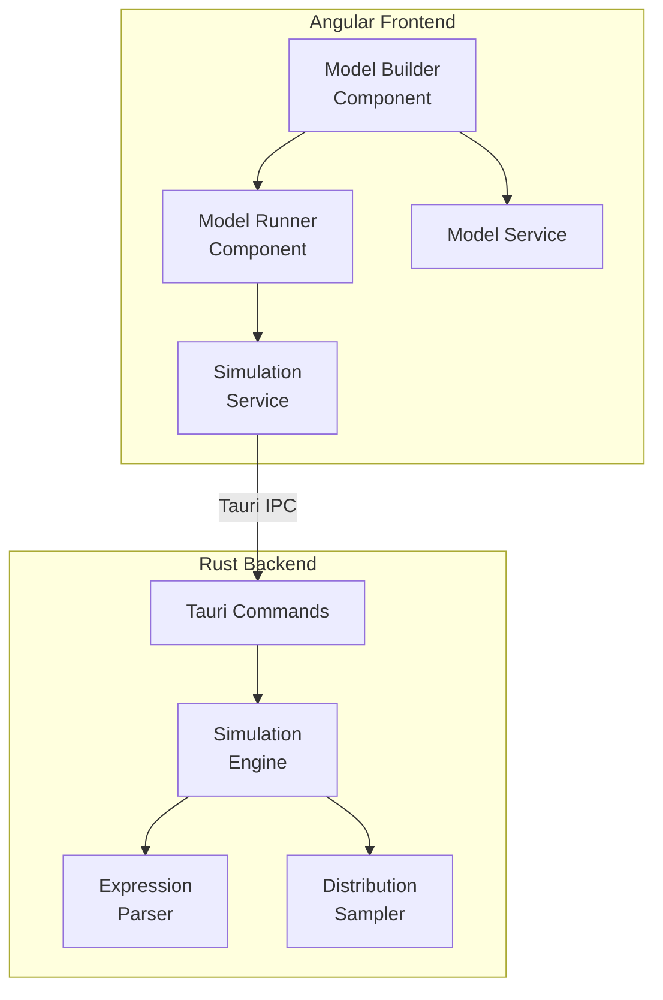

# Design Document: Monte Carlo Model Runner

## Overview

The Monte Carlo Model Runner is an Angular component that integrates with the existing Model Builder to provide simulation execution capabilities. The design follows a client-server architecture where the Angular frontend handles user interaction and visualization, while a Rust backend (accessed via Tauri) performs the computationally intensive simulation work.

The component provides:
1. **Configuration Interface**: Dialog for setting simulation parameters
2. **Backend Integration**: Tauri commands for communicating with Rust simulation engine
3. **Results Visualization**: Histogram and summary statistics display
4. **Export Functionality**: CSV export of simulation results

The design emphasizes asynchronous execution with progress feedback, comprehensive error handling, and seamless integration with the existing Model Builder component.

## Architecture

### System Architecture

**System Architecture Overview**



### Component Structure

```
model-runner/
├── model-runner.component.ts           # Main runner component
├── model-runner.component.html         # Main template
├── model-runner.component.css          # Component styles
├── simulation-config-dialog/
│   ├── simulation-config-dialog.component.ts   # Configuration dialog
│   ├── simulation-config-dialog.component.html
│   └── simulation-config-dialog.component.css
├── results-display/
│   ├── results-display.component.ts            # Results visualization
│   ├── results-display.component.html
│   └── results-display.component.css
└── services/
    ├── simulation.service.ts                   # Frontend simulation service
    ├── statistics.service.ts                   # Statistical calculations
    └── csv-export.service.ts                   # CSV export functionality

src-tauri/
└── src/
    ├── commands/
    │   └── simulation.rs                       # Tauri command handlers
    ├── simulation/
    │   ├── engine.rs                           # Main simulation engine
    │   ├── parser.rs                           # Expression parser
    │   ├── evaluator.rs                        # Expression evaluator
    │   └── sampler.rs                          # Distribution sampler
    └── lib.rs                                  # Tauri app setup
```

### Data Flow

**Simulation Execution Flow**

```mermaid
sequenceDiagram
    participant User
    participant UI as Model Runner UI
    participant Service as Simulation Service
    participant Tauri as Tauri IPC
    participant Backend as Rust Backend
    
    User->>UI: Click "Run Simulation"
    UI->>UI: Open Config Dialog
    User->>UI: Select Iteration Count
    User->>UI: Click "Start"
    
    UI->>Service: runSimulation(config)
    Service->>Service: Serialize Model
    Service->>Tauri: invoke("run_simulation", model)
    Tauri->>Backend: Execute Command
    
    Backend->>Backend: Parse Expression
    Backend->>Backend: Execute Iterations
    Note over Backend: Sample → Evaluate → Store
    
    Backend-->>Tauri: Return Results
    Tauri-->>Service: Promise Resolves
    Service-->>UI: Update Results Signal
    UI-->>User: Display Histogram & Statistics
```



3. **Visualization Phase**:
   - Frontend receives results
   - Frontend calculates statistics
   - Frontend generates histogram
   - Frontend displays results and statistics

4. **Export Phase** (optional):
   - User clicks "Export to CSV"
   - Frontend generates CSV content
   - Frontend triggers browser download

## Components and Interfaces

### ModelRunnerComponent

**Purpose**: Main container component that provides the "Run Simulation" button and orchestrates the simulation workflow.

**Responsibilities**:
- Display "Run Simulation" button when model is valid
- Open configuration dialog
- Coordinate simulation execution
- Display results when available
- Handle errors

**Template Structure**:
```html
<div class="model-runner-container">
  <p-button 
    label="Run Simulation" 
    icon="pi pi-play"
    (onClick)="openConfigDialog()"
    [disabled]="!canRunSimulation()"
    [pTooltip]="getDisabledTooltip()"
  />
  
  <app-simulation-config-dialog
    [(visible)]="configDialogVisible"
    (start)="runSimulation($event)"
  />
  
  <p-progressSpinner *ngIf="isRunning()" />
  <div *ngIf="isRunning()" class="progress-message">
    Running simulation: {{ iterationCount() }} iterations
  </div>
  
  <app-results-display
    *ngIf="results()"
    [results]="results()"
  />
</div>
```

**Key Methods**:
- `canRunSimulation()`: Returns true if model has variables and valid expression
- `getDisabledTooltip()`: Returns explanation for why button is disabled
- `openConfigDialog()`: Opens configuration dialog
- `runSimulation(config)`: Starts simulation with given configuration
- `isRunning()`: Returns true if simulation is in progress
- `results()`: Returns simulation results signal

---

### SimulationConfigDialogComponent

**Purpose**: Dialog for configuring simulation parameters before execution.

**Responsibilities**:
- Display preset iteration options
- Allow custom iteration count input
- Validate iteration count
- Emit start event with configuration

**Template Structure**:
```html
<p-dialog 
  [(visible)]="visible" 
  header="Configure Simulation"
  [style]="{width: '500px'}"
>
  <div class="config-form">
    <h4>Number of Iterations</h4>
    
    <div class="preset-options">
      <p-button 
        *ngFor="let preset of presetOptions"
        [label]="preset.toString()"
        (onClick)="selectPreset(preset)"
        [outlined]="iterationCount !== preset"
      />
    </div>
    
    <div class="custom-input">
      <label for="customIterations">Custom</label>
      <input 
        pInputText 
        id="customIterations"
        type="number"
        [(ngModel)]="iterationCount"
        (ngModelChange)="validateIterationCount()"
        min="1"
      />
      <small *ngIf="iterationError" class="error">{{ iterationError }}</small>
    </div>
  </div>
  
  <ng-template pTemplate="footer">
    <p-button 
      label="Cancel" 
      (onClick)="onCancel()"
      [outlined]="true"
    />
    <p-button 
      label="Start" 
      (onClick)="onStart()"
      [disabled]="!isValid()"
    />
  </ng-template>
</p-dialog>
```

**Inputs**:
- `visible: boolean`: Controls dialog visibility

**Outputs**:
- `visibleChange: EventEmitter<boolean>`: Emits when dialog closes
- `start: EventEmitter<SimulationConfig>`: Emits when user starts simulation

**Key Methods**:
- `selectPreset(count: number)`: Sets iteration count to preset value
- `validateIterationCount()`: Validates custom iteration count
- `isValid()`: Returns true if configuration is valid
- `onStart()`: Emits start event with configuration
- `onCancel()`: Closes dialog without starting

---

### ResultsDisplayComponent

**Purpose**: Display simulation results including histogram and summary statistics.

**Responsibilities**:
- Calculate and display histogram
- Calculate and display summary statistics
- Provide CSV export button
- Format numeric values appropriately

**Template Structure**:
```html
<div class="results-container">
  <p-card header="Simulation Results">
    <div class="results-layout">
      <!-- Histogram -->
      <div class="histogram-section">
        <h3>Output Distribution</h3>
        <p-chart 
          type="bar"
          [data]="histogramData()"
          [options]="histogramOptions"
        />
      </div>
      
      <!-- Summary Statistics -->
      <div class="statistics-section">
        <h3>Summary Statistics</h3>
        <div class="stat-grid">
          <div class="stat-item">
            <span class="stat-label">Mean:</span>
            <span class="stat-value">{{ formatNumber(statistics().mean) }}</span>
          </div>
          <div class="stat-item">
            <span class="stat-label">Median:</span>
            <span class="stat-value">{{ formatNumber(statistics().median) }}</span>
          </div>
          <div class="stat-item">
            <span class="stat-label">Std Dev:</span>
            <span class="stat-value">{{ formatNumber(statistics().stdDev) }}</span>
          </div>
          <div class="stat-item">
            <span class="stat-label">Min:</span>
            <span class="stat-value">{{ formatNumber(statistics().min) }}</span>
          </div>
          <div class="stat-item">
            <span class="stat-label">Max:</span>
            <span class="stat-value">{{ formatNumber(statistics().max) }}</span>
          </div>
          <div class="stat-item">
            <span class="stat-label">25th Percentile:</span>
            <span class="stat-value">{{ formatNumber(statistics().p25) }}</span>
          </div>
          <div class="stat-item">
            <span class="stat-label">75th Percentile:</span>
            <span class="stat-value">{{ formatNumber(statistics().p75) }}</span>
          </div>
          <div class="stat-item">
            <span class="stat-label">95th Percentile:</span>
            <span class="stat-value">{{ formatNumber(statistics().p95) }}</span>
          </div>
        </div>
      </div>
    </div>
    
    <div class="export-section">
      <p-button 
        label="Export to CSV"
        icon="pi pi-download"
        (onClick)="exportToCSV()"
      />
    </div>
  </p-card>
</div>
```

**Inputs**:
- `results: SimulationResults`: The simulation results to display

**Key Methods**:
- `histogramData()`: Computed signal generating histogram chart data
- `statistics()`: Computed signal calculating summary statistics
- `formatNumber(value: number)`: Formats numbers to appropriate decimal places
- `exportToCSV()`: Triggers CSV export

---

### SimulationService

**Purpose**: Frontend service for coordinating simulation execution via Tauri.

**Responsibilities**:
- Serialize model definition
- Invoke Tauri commands
- Handle async execution
- Manage simulation state
- Handle errors

**Interface**:
```typescript
export interface SimulationConfig {
  iterationCount: number;
}

export interface IntermediateExpression {
  name: string;
  expression: string;
}

export interface ModelDefinition {
  variables: Variable[];
  constants: Constant[];
  intermediateExpressions: IntermediateExpression[];
  targetExpression: string;
  iterationCount: number;
}

export interface SimulationResults {
  values: number[];
  errors?: string[];
}

export class SimulationService {
  private isRunningSignal = signal<boolean>(false);
  private resultsSignal = signal<SimulationResults | null>(null);
  private errorSignal = signal<string | null>(null);
  
  readonly isRunning = this.isRunningSignal.asReadonly();
  readonly results = this.resultsSignal.asReadonly();
  readonly error = this.errorSignal.asReadonly();
  
  async runSimulation(
    model: ModelState,
    config: SimulationConfig
  ): Promise<void>;
  
  private serializeModel(
    model: ModelState,
    config: SimulationConfig
  ): ModelDefinition;
  
  private async invokeTauriCommand(
    modelDef: ModelDefinition
  ): Promise<SimulationResults>;
}
```

**Key Methods**:
- `runSimulation()`: Main entry point for running simulations
- `serializeModel()`: Converts ModelState to ModelDefinition JSON
- `invokeTauriCommand()`: Calls Tauri backend with model definition

---

### StatisticsService

**Purpose**: Calculate summary statistics from simulation results.

**Responsibilities**:
- Calculate mean, median, standard deviation
- Calculate min, max
- Calculate percentiles
- Provide efficient statistical algorithms

**Interface**:
```typescript
export interface SummaryStatistics {
  mean: number;
  median: number;
  stdDev: number;
  min: number;
  max: number;
  p25: number;
  p75: number;
  p95: number;
}

export class StatisticsService {
  calculateStatistics(values: number[]): SummaryStatistics;
  
  private calculateMean(values: number[]): number;
  private calculateMedian(values: number[]): number;
  private calculateStdDev(values: number[], mean: number): number;
  private calculatePercentile(values: number[], percentile: number): number;
}
```

**Statistical Formulas**:

1. **Mean**: `μ = (Σ xi) / n`
2. **Median**: Middle value of sorted array (or average of two middle values)
3. **Standard Deviation**: `σ = √((Σ (xi - μ)²) / n)`
4. **Percentile**: Linear interpolation between sorted values

---

### CSVExportService

**Purpose**: Generate and download CSV files from simulation results.

**Responsibilities**:
- Format results as CSV
- Include header row
- Include summary statistics
- Trigger browser download
- Generate timestamped filename

**Interface**:
```typescript
export class CSVExportService {
  exportResults(
    results: SimulationResults,
    statistics: SummaryStatistics
  ): void;
  
  private generateCSVContent(
    results: SimulationResults,
    statistics: SummaryStatistics
  ): string;
  
  private generateFilename(): string;
  private triggerDownload(content: string, filename: string): void;
}
```

**CSV Format**:
```csv
Iteration,Output Value
1,42.5
2,38.9
...
n,45.2

Summary Statistics
Mean,41.2
Median,40.8
Std Dev,5.3
Min,25.1
Max,58.7
25th Percentile,37.5
75th Percentile,44.9
95th Percentile,51.2
```

---

### Rust Backend Components

#### Tauri Command Handler

**Purpose**: Expose simulation functionality to frontend via Tauri IPC.

**Interface**:
```rust
#[tauri::command]
async fn run_simulation(model: ModelDefinition) -> Result<SimulationResults, String> {
    // Parse all expressions
    let mut parsed_exprs = HashMap::new();
    for expr in &model.intermediate_expressions {
        let ast = parse_expression(&expr.expression)?;
        parsed_exprs.insert(expr.name.clone(), ast);
    }
    let target_ast = parse_expression(&model.target_expression)?;
    
    // Build dependency graph and check for circular references
    let eval_order = build_evaluation_order(&parsed_exprs, &target_ast)?;
    
    // Run simulation
    let engine = SimulationEngine::new(model);
    let results = engine.run(parsed_exprs, target_ast, eval_order)?;
    
    Ok(results)
}
```

---

#### SimulationEngine

**Purpose**: Execute Monte Carlo simulation iterations.

**Responsibilities**:
- Coordinate sampling and evaluation
- Execute specified number of iterations
- Collect results
- Handle errors gracefully

**Interface**:
```rust
pub struct SimulationEngine {
    variables: Vec<Variable>,
    iteration_count: usize,
}

impl SimulationEngine {
    pub fn new(model: ModelDefinition) -> Self;
    
    pub fn run(
        &self,
        intermediate_exprs: HashMap<String, Expr>,
        target_expr: Expr,
        eval_order: Vec<String>
    ) -> Result<SimulationResults, String>;
    
    fn run_iteration(
        &self,
        intermediate_exprs: &HashMap<String, Expr>,
        target_expr: &Expr,
        eval_order: &[String]
    ) -> Result<f64, String>;
}
```

---

#### ExpressionParser

**Purpose**: Parse mathematical expressions into abstract syntax trees.

**Responsibilities**:
- Tokenize expression string
- Build AST using recursive descent parsing
- Support operators: +, -, *, /, ()
- Validate syntax
- Identify identifiers

**Interface**:
```rust
pub enum Expr {
    Number(f64),
    Identifier(String),
    BinaryOp {
        op: Operator,
        left: Box<Expr>,
        right: Box<Expr>,
    },
}

pub enum Operator {
    Add,
    Subtract,
    Multiply,
    Divide,
}

pub fn parse_expression(input: &str) -> Result<Expr, String>;

pub fn extract_identifiers(expr: &Expr) -> HashSet<String>;

pub fn build_dependency_graph(
    intermediate_exprs: &HashMap<String, Expr>,
    target_expr: &Expr
) -> HashMap<String, HashSet<String>>;

pub fn build_evaluation_order(
    intermediate_exprs: &HashMap<String, Expr>,
    target_expr: &Expr
) -> Result<Vec<String>, String>;
```

**Parsing Strategy**:
- Use recursive descent parser
- Implement operator precedence (*, / before +, -)
- Handle parentheses for grouping
- Return descriptive error messages

---

#### ExpressionEvaluator

**Purpose**: Evaluate parsed expressions with variable values.

**Responsibilities**:
- Traverse AST
- Substitute identifiers with values
- Compute arithmetic operations
- Handle division by zero
- Follow operator precedence

**Interface**:
```rust
pub struct Evaluator {
    values: HashMap<String, f64>,
}

impl Evaluator {
    pub fn new(values: HashMap<String, f64>) -> Self;
    
    pub fn add_value(&mut self, name: String, value: f64);
    
    pub fn evaluate(&self, expr: &Expr) -> Result<f64, String>;
    
    fn evaluate_binary_op(
        &self,
        op: &Operator,
        left: f64,
        right: f64
    ) -> Result<f64, String>;
}
```

---

#### DistributionSampler

**Purpose**: Sample values from probability distributions.

**Responsibilities**:
- Sample from Normal distribution
- Sample from Lognormal distribution
- Sample from Uniform distribution
- Use high-quality RNG

**Interface**:
```rust
use rand::Rng;
use rand_distr::{Normal, LogNormal, Uniform, Distribution};

pub struct Sampler {
    rng: rand::rngs::ThreadRng,
}

impl Sampler {
    pub fn new() -> Self;
    
    pub fn sample_normal(&mut self, mean: f64, std_dev: f64) -> f64;
    pub fn sample_lognormal(&mut self, mean: f64, std_dev: f64) -> f64;
    pub fn sample_uniform(&mut self, min: f64, max: f64) -> f64;
}
```

**Implementation Notes**:
- Use `rand` crate for RNG
- Use `rand_distr` crate for distribution implementations
- ThreadRng provides cryptographically secure randomness

## Data Models

### Frontend Models

```typescript
// Reuse existing models from Model Builder
export interface Variable {
  name: string;
  distribution: Distribution;
}

export interface ModelState {
  variables: Variable[];
  intermediateExpressions: IntermediateExpression[];
  targetExpression: string;
}

export interface IntermediateExpression {
  name: string;
  expression: string;
}

// New models for simulation
export interface SimulationConfig {
  iterationCount: number;
}

export interface ModelDefinition {
  variables: Variable[];
  intermediateExpressions: IntermediateExpression[];
  targetExpression: string;
  iterationCount: number;
}

export interface SimulationResults {
  values: number[];
  errors?: string[];
}

export interface SummaryStatistics {
  mean: number;
  median: number;
  stdDev: number;
  min: number;
  max: number;
  p25: number;
  p75: number;
  p95: number;
}

export interface HistogramBin {
  min: number;
  max: number;
  count: number;
}
```

### Backend Models

```rust
#[derive(Serialize, Deserialize)]
pub struct ModelDefinition {
    pub variables: Vec<Variable>,
    pub intermediate_expressions: Vec<IntermediateExpression>,
    pub target_expression: String,
    pub iteration_count: usize,
}

#[derive(Serialize, Deserialize)]
pub struct IntermediateExpression {
    pub name: String,
    pub expression: String,
}

#[derive(Serialize, Deserialize)]
pub struct Variable {
    pub name: String,
    pub distribution: Distribution,
}

#[derive(Serialize, Deserialize)]
#[serde(tag = "type")]
pub enum Distribution {
    Normal { mean: f64, std_dev: f64 },
    Lognormal { mean: f64, std_dev: f64 },
    Uniform { min: f64, max: f64 },
}

#[derive(Serialize, Deserialize)]
pub struct SimulationResults {
    pub values: Vec<f64>,
    pub errors: Option<Vec<String>>,
}
```

## Correctness Properties

A property is a characteristic or behavior that should hold true across all valid executions of a system—essentially, a formal statement about what the system should do. Properties serve as the bridge between human-readable specifications and machine-verifiable correctness guarantees.

### Property 1: Iteration Count Validation

*For any* iteration count input, the system should accept it only if it is a positive integer, and should reject zero, negative numbers, and non-integer values.

**Validates: Requirements 1.5, 1.6**

### Property 2: Complete Model Serialization

*For any* model state with variables, intermediate expressions, target expression, serialization should produce a JSON object containing all variables with their complete distribution information, all intermediate expressions with names and expression text, the target expression text, and the iteration count.

**Validates: Requirements 2.1, 2.2, 2.3, 2.4, 2.5**

### Property 3: Expression Parsing Correctness

*For any* valid mathematical expression using +, -, *, /, and parentheses, the parser should successfully parse it into an AST without errors.

**Validates: Requirements 3.1, 3.2**

### Property 4: Identifier Extraction

*For any* expression containing variable or intermediate expression references, the parser should correctly identify all unique identifiers present in the expression.

**Validates: Requirements 3.3**

### Property 5: Syntax Error Detection

*For any* expression with syntax errors (unbalanced parentheses, invalid operator placement, consecutive operators), the parser should return an error message describing the syntax error.

**Validates: Requirements 3.4**

### Property 6: Undefined Identifier Detection

*For any* expression containing identifiers not present in the model's variables, the parser should return an error message listing all undefined identifiers.

**Validates: Requirements 3.5**

### Property 7: Distribution Sampling Bounds

*For any* Uniform distribution with min and max parameters, all sampled values should be within the range [min, max].

**Validates: Requirements 4.4**

### Property 8: Complete Variable Sampling

*For any* model with N variables, each simulation iteration should sample exactly N values, one for each variable.

**Validates: Requirements 4.1, 4.6**

### Property 9: Expression Evaluation Correctness

*For any* expression and set of variable and intermediate expression values, evaluation should produce the mathematically correct result following standard operator precedence (multiplication and division before addition and subtraction).

**Validates: Requirements 5.2, 5.3, 5.4**

### Property 10: Iteration Count Accuracy

*For any* specified iteration count N, the simulation should execute exactly N iterations and return exactly N result values (excluding iterations that encountered errors).

**Validates: Requirements 6.1, 6.3**

### Property 11: Results Array Completeness

*For any* completed simulation, the returned results should include an array of all output values from successful iterations.

**Validates: Requirements 6.4**

### Property 12: Error Information Inclusion

*For any* simulation where some iterations encounter errors, the returned results should include error information describing which iterations failed and why.

**Validates: Requirements 6.5**

### Property 13: Statistical Calculation Correctness

*For any* array of numeric values, the calculated mean, median, standard deviation, min, max, and percentiles (25th, 75th, 95th) should match the mathematically correct values for those statistics.

**Validates: Requirements 9.1, 9.2, 9.3, 9.4, 9.5, 9.6, 9.7, 9.8**

### Property 14: Histogram Bin Coverage

*For any* set of simulation results, the histogram bins should collectively cover the entire range from minimum to maximum value, with no gaps or overlaps.

**Validates: Requirements 8.2**

### Property 15: CSV Structure Completeness

*For any* simulation results, the generated CSV should include a header row, one data row per iteration with iteration number and output value, and summary statistics rows at the end.

**Validates: Requirements 11.2, 11.3, 11.4, 11.5**

### Property 16: CSV Filename Format

*For any* CSV export, the generated filename should match the pattern "simulation-results-YYYY-MM-DD-HHmmss.csv" where the timestamp reflects the export time.

**Validates: Requirements 11.7**

### Property 17: Pre-Simulation Validation

*For any* model state, if the model has no variables or has an invalid expression, attempting to run a simulation should be prevented and an error message should be displayed.

**Validates: Requirements 10.1, 10.2, 10.3**

### Property 18: Model State Reactivity

*For any* change to the model state in the Model Builder, the Model Runner should immediately reflect those changes in its ability to run simulations and in the data it sends to the backend.

**Validates: Requirements 12.2, 12.3**

### Property 19: Evaluation Order Correctness

*For any* set of intermediate expressions and target expression, the evaluation order should respect all dependencies such that each expression is evaluated only after all expressions it references have been evaluated.

**Validates: Requirements 3.4, 3.7, 5.1**

### Property 20: Circular Reference Detection

*For any* set of intermediate expressions containing circular references (A depends on B, B depends on A), the system should detect the circular dependency and return an error before attempting evaluation.

**Validates: Requirements 3.4, 10.4**

## Error Handling

### Frontend Error Handling

1. **Validation Errors**:
   - Invalid iteration count: "Iteration count must be a positive integer"
   - No variables defined: "Cannot run simulation: No variables defined. Add at least one variable in the Model Builder."
   - Invalid expression: "Cannot run simulation: Expression is invalid. Fix expression errors in the Model Builder."

2. **Backend Communication Errors**:
   - Tauri command failure: "Failed to communicate with simulation engine. Please try again."
   - Timeout: "Simulation timed out. Try reducing the number of iterations."

3. **Backend Execution Errors**:
   - Parse error: Display error message from backend
   - Evaluation error: "Simulation encountered errors during execution. Check results for details."

### Backend Error Handling

1. **Parse Errors**:
   - Syntax errors: Return descriptive message with error location
   - Undefined identifiers: Return list of undefined identifiers

2. **Evaluation Errors**:
   - Division by zero: Record error for that iteration, continue with next
   - Overflow/underflow: Record error for that iteration, continue with next

3. **System Errors**:
   - Out of memory: Return error message
   - Thread panic: Catch and return error message

### Error Recovery

- All errors are recoverable - user can fix issues and retry
- Errors are displayed with clear, actionable messages
- Error states can be dismissed to return to normal operation
- Partial results are preserved when possible (e.g., if some iterations succeed)

## Testing Strategy

### Dual Testing Approach

The testing strategy employs both unit tests and property-based tests to ensure comprehensive coverage:

- **Unit Tests**: Verify specific examples, edge cases, and error conditions
- **Property Tests**: Verify universal properties across all inputs using randomized test data

Both testing approaches are complementary and necessary for comprehensive validation.

### Property-Based Testing

Property-based testing will be implemented using:
- **Frontend**: `fast-check` library for TypeScript/JavaScript
- **Backend**: `proptest` or `quickcheck` crate for Rust

**Configuration**:
- Minimum 100 iterations per property test
- Each test tagged with comment referencing design property
- Tag format: `// Feature: monte-carlo-model-runner, Property {number}: {property_text}`

**Example Property Test (Frontend)**:
```typescript
import fc from 'fast-check';

describe('Model Runner Property Tests', () => {
  it('Property 1: Iteration Count Validation', () => {
    // Feature: monte-carlo-model-runner, Property 1: Iteration count validation
    fc.assert(
      fc.property(
        fc.integer(),
        (count) => {
          const result = validateIterationCount(count);
          
          if (count > 0 && Number.isInteger(count)) {
            expect(result.isValid).toBe(true);
          } else {
            expect(result.isValid).toBe(false);
          }
        }
      ),
      { numRuns: 100 }
    );
  });
});
```

**Example Property Test (Backend)**:
```rust
#[cfg(test)]
mod tests {
    use proptest::prelude::*;
    
    proptest! {
        #[test]
        // Feature: monte-carlo-model-runner, Property 7: Distribution sampling bounds
        fn test_uniform_sampling_bounds(min: f64, max: f64) {
            prop_assume!(min < max);
            
            let mut sampler = Sampler::new();
            let value = sampler.sample_uniform(min, max);
            
            prop_assert!(value >= min && value <= max);
        }
    }
}
```

### Unit Testing

Unit tests focus on:

1. **Specific Examples**:
   - Simulation with known model and expected results
   - CSV export with specific data
   - Histogram generation with known distribution

2. **Edge Cases**:
   - Empty results array
   - Single iteration
   - Very large iteration counts
   - Expressions causing division by zero
   - All iterations failing

3. **Integration Points**:
   - Tauri command invocation
   - Model service integration
   - Component communication
   - Dialog open/close behavior

4. **Error Conditions**:
   - Each validation error type
   - Backend error responses
   - Timeout scenarios
   - Network failures

### Testing Balance

- Property tests handle comprehensive input coverage through randomization
- Unit tests focus on specific scenarios, integration, and edge cases
- Avoid excessive unit tests for cases well-covered by property tests
- Each correctness property should be implemented by a SINGLE property-based test

### Test Organization

```
Frontend:
src/app/model-runner/
├── __tests__/
│   ├── model-runner.component.spec.ts
│   ├── simulation-config-dialog.component.spec.ts
│   ├── results-display.component.spec.ts
│   ├── simulation.service.spec.ts
│   ├── statistics.service.spec.ts
│   ├── csv-export.service.spec.ts
│   └── properties/
│       ├── validation.property.spec.ts
│       ├── serialization.property.spec.ts
│       ├── statistics.property.spec.ts
│       └── csv-export.property.spec.ts

Backend:
src-tauri/src/
├── simulation/
│   ├── engine_test.rs
│   ├── parser_test.rs
│   ├── evaluator_test.rs
│   └── sampler_test.rs
└── properties/
    ├── parsing_properties.rs
    ├── evaluation_properties.rs
    └── sampling_properties.rs
```
