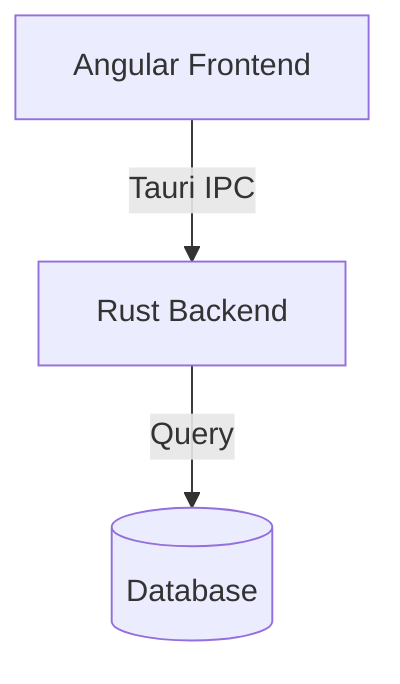
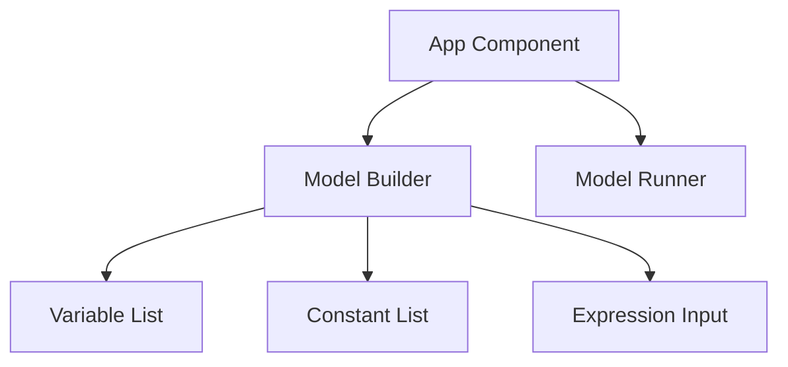
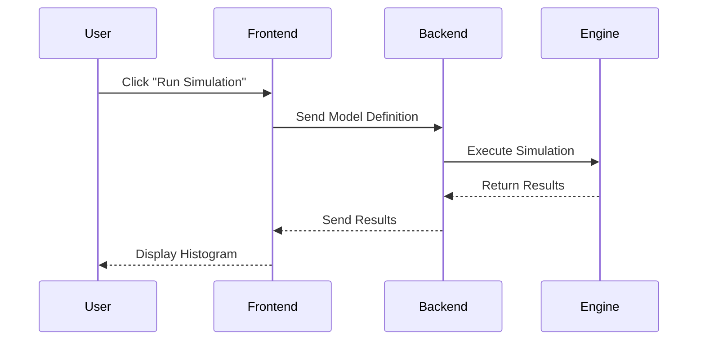
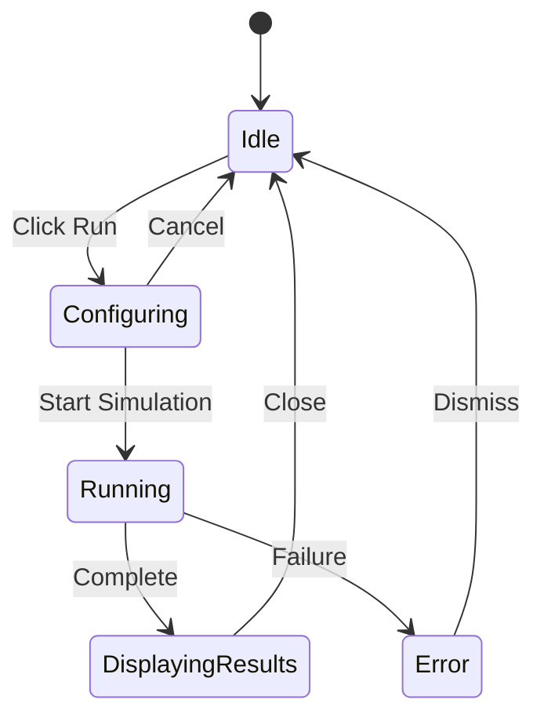
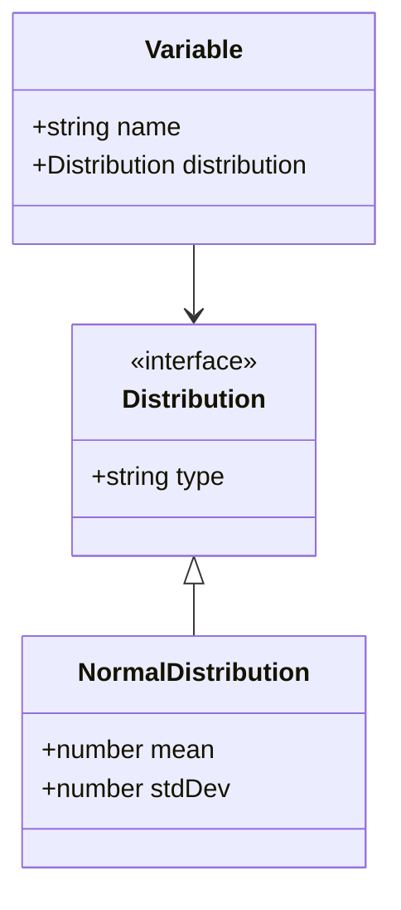
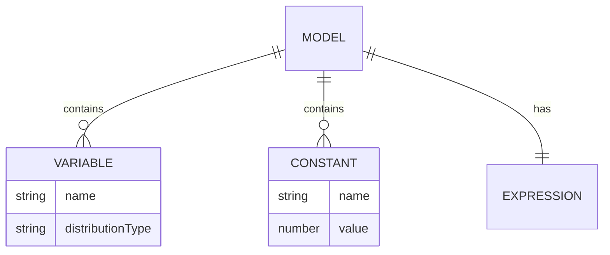
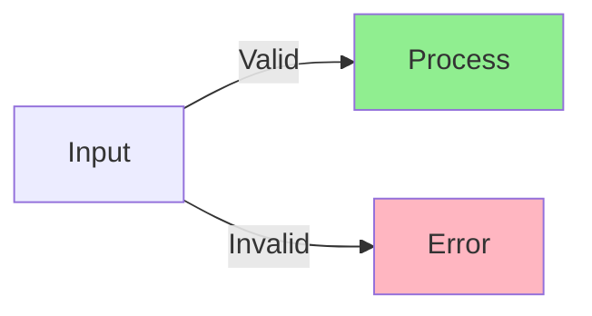
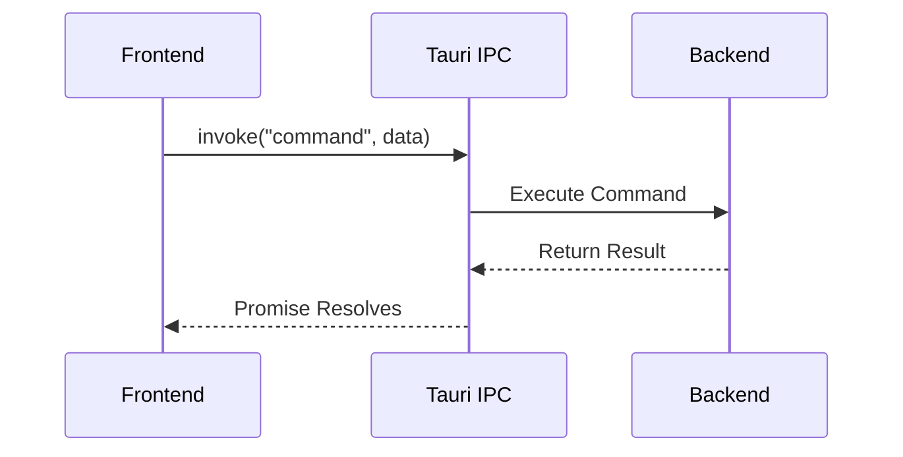
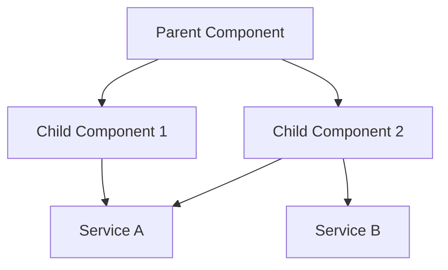
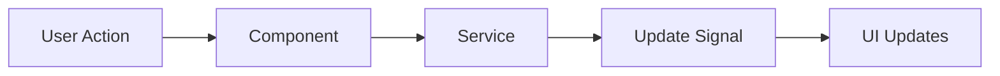

# Diagram Guidelines

## Overview

All diagrams in documentation should use Mermaid syntax for consistency, version control friendliness, and easy rendering in Markdown viewers.

## Why Mermaid?

- **Version Control**: Text-based diagrams work well with Git
- **Consistency**: Standardized syntax across all documentation
- **Rendering**: Supported by GitHub, GitLab, VS Code, and many Markdown viewers
- **Maintainability**: Easy to update without specialized tools
- **Accessibility**: Can be read as text when rendering is unavailable

## Diagram Types

### Architecture Diagrams

Use flowcharts or block diagrams for system architecture:

### Component Structure

Use flowcharts for component hierarchies:

### Data Flow

Use sequence diagrams for data flow and interactions:

### State Machines

Use state diagrams for component states:

### Class Diagrams

Use class diagrams for data models and interfaces:

### Entity Relationships

Use ER diagrams for data relationships:

## Best Practices

### 1. Keep Diagrams Simple

- Focus on one concept per diagram
- Avoid overcrowding with too many elements
- Use multiple diagrams if needed

### 2. Use Consistent Naming

- Match names in diagrams to code/documentation
- Use PascalCase for components/classes
- Use camelCase for methods/properties

### 3. Add Descriptive Labels

- Label all arrows and connections
- Use clear, concise descriptions
- Avoid abbreviations unless well-known

### 4. Use Colors Sparingly

Mermaid supports styling, but use it judiciously:

### 5. Include Diagram Titles

Always add a title or caption above the diagram:

**System Architecture Overview**

### 6. Test Rendering

- Preview diagrams in VS Code or GitHub
- Ensure syntax is correct
- Verify all elements are visible

## Common Patterns

### Frontend-Backend Communication

### Component Hierarchy

### State Management Flow

## Mermaid Syntax Reference

### Graph Directions

- `TB` or `TD`: Top to Bottom
- `BT`: Bottom to Top
- `LR`: Left to Right
- `RL`: Right to Left

### Node Shapes

- `[Text]`: Rectangle
- `(Text)`: Rounded rectangle
- `([Text])`: Stadium shape
- `[[Text]]`: Subroutine
- `[(Text)]`: Cylindrical (database)
- `((Text))`: Circle
- `{Text}`: Rhombus (decision)

### Arrow Types

- `-->`: Solid arrow
- `-.->`: Dotted arrow
- `==>`: Thick arrow
- `--text-->`: Arrow with label

### Sequence Diagram Arrows

- `->`: Solid line
- `-->`: Dotted line
- `->>`: Solid arrow
- `-->>`: Dotted arrow

## Tools and Resources

### VS Code Extensions

- **Markdown Preview Mermaid Support**: Renders Mermaid in preview
- **Mermaid Editor**: Dedicated Mermaid editor

### Online Editors

- [Mermaid Live Editor](https://mermaid.live/): Test and export diagrams
- [Mermaid Documentation](https://mermaid.js.org/): Official docs

### Rendering

- GitHub and GitLab render Mermaid automatically
- Most modern Markdown viewers support Mermaid
- Can export to PNG/SVG if needed

## Migration from ASCII/Text Diagrams

When updating existing documentation:

1. Identify all ASCII art or text-based diagrams
2. Determine appropriate Mermaid diagram type
3. Convert to Mermaid syntax
4. Test rendering
5. Remove old ASCII art

## Examples in This Project

See these files for Mermaid diagram examples:
- `docs/requirements/monte-carlo-model-runner/design.md` - Architecture diagrams
- `docs/requirements/monte-carlo-model-builder/design.md` - Component structure

## Checklist for New Diagrams

- [ ] Diagram uses Mermaid syntax
- [ ] Diagram has a descriptive title/caption
- [ ] All elements are clearly labeled
- [ ] Diagram renders correctly in preview
- [ ] Diagram follows project naming conventions
- [ ] Diagram is focused on a single concept
- [ ] Arrows and connections are labeled
- [ ] Styling is minimal and purposeful
